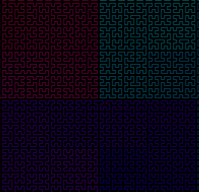

### Hilbert Curve
Hilbert Curve is a continous, fractal, space filling curve.

# Rules  

**Alphabet** : A, B   
**Constants** : F + −  
**Axiom** : A  
**Production rules**:  
```
A → − B F + A F A + F B −    
B → + A F − B F B − F A +  
```
Here, "F" means "draw forward", "−" means "turn left 90°", "+" means "turn right 90°", and "A" and "B" are ignored during drawing.  

https://en.wikipedia.org/wiki/Hilbert_curve




