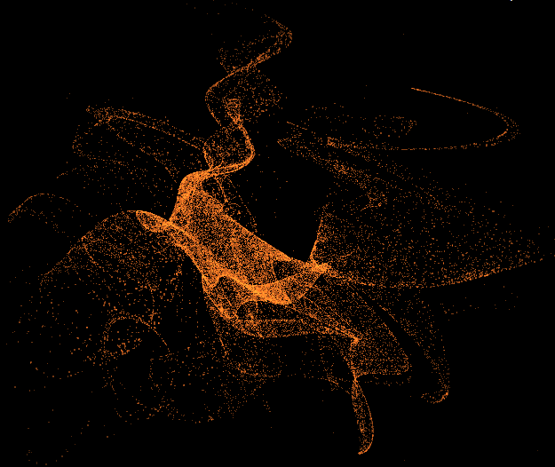

### Bedhead Attractor
I have been able to find absolutely no information on this except the formula, in which I added a 'z' in myself for ascetics.

```JS
x[n+1] = Math.sin(x * y / b) * y + Math.cos(a * x - y)
y[n+1] = x + Math.sin(y) / b
z[n+1] = y + Math.cos(y*x) / b
```
```JS
x[0], y[0], z[0] = 0;
a = 0..5
b = 0..1
```

