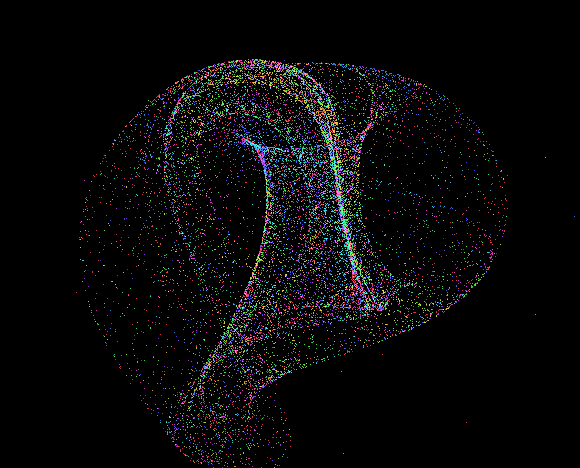

### Lorenz Attractor 86


```JS
x[n+1] += (-a * x - y * y - z * z + a * b) * d
y[n+1] += (-y + x * y - f * x * z + g) * d
z[n+1] += (-z + f * x * y + x * z) * b) * d
```

```
a = 0.5..1.5    b = 4 .. 5
g = 0 .. 2      f = 0 .. 0.5  
d = 0.1 .. 0.15
```

