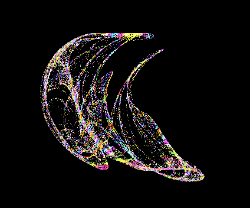

### De jong attractor

```JS
x1[t+1] = Math.sin(opts.a * z) - Math.cos(opts.b * x)
y1[t+1] = Math.sin(opts.c * x) - Math.cos(opts.d * y)
z1[t+1] = Math.sin(opts.e * y) - Math.cos(opts.f * z)
```
where

```JS
a, b, c, d, e, f = [-5..5];
```


After browsing a few sites I came across https://www.algosome.com/articles/strange-attractors-de-jong.html which included a cool algorithm for the color.

```Js

let ip = 1/(2*Math.PI)
let v = (x-Math.pow(x[t+1], 2)) + (y - Math.pow(y[t+1] , 2)) * Math.atan2(y[t+1] , x[t+1] )* ip
red[t+1] = (red+Math.abs(Math.sin(v*Math.PI*3.2-Math.PI*.2)))*.5
green[t+1] = (green + Math.abs(Math.sin(v*Math.PI*12.3+Math.PI*1.5)*.5+.5))*.5
blue[t+1] = (blue + Math.sin(v*Math.PI*3.84+Math.PI/2-.6)*.5+.5)*.5


```

