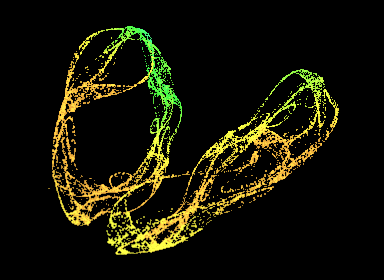

### Polynomial, Type C


```JS
 x[+1] = g("x", "a") + x * (g("x", "b") + g("x", "c") * x + g("x", "d") * y) + y * (g("x", "e") + g("x", "f") * y)
 y[+1] = g("y", "a") + y * (g("y", "b") + g("y", "c") * y + g("y", "d") * z) + z * (g("y", "e") + g("y", "f") * z)
 z[+1] = g("z", "a") + z * (g("z", "b") + g("z", "c") * z + g("z", "d") * x) + x * (g("z", "e") + g("z", "f") * x)
```

```JS
g = {
    x:{
        a: -0.653165,
        b: -0.972152,
        c: -0.713924,
        d: -0.481,
        e: 0.516456,
        f: -0.592405
    },
    y :{
        a: -0.268,
        b: 0.827,
        c: 0.379747,
        d: -0.943,
        e: -0.072,
        f: 1.2,
    },
    z : {
        a: -0.47,
        b: 0.041,
        c: 0,
        d: 0.914,
        e: -0.531646,
        f: 0.364557
    }
}
```

