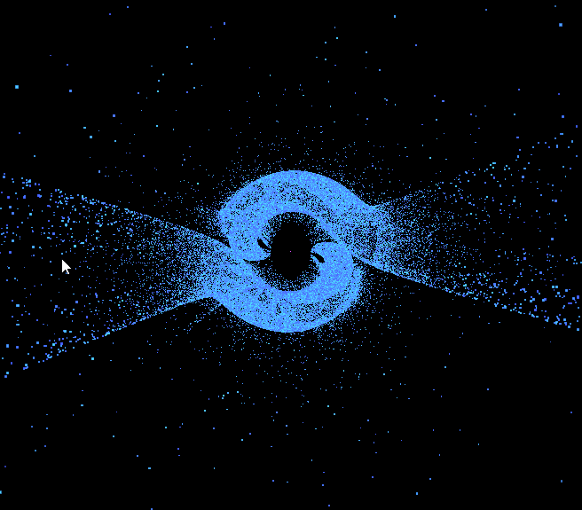

###  Svensson attractor (modified)

This is my own modified version of the [svensson attractor](/2d_Svensson_attractor)
 ```js
x+1 = d * Math.sin(a * x) - Math.sin(b * y)
y+1 = c * Math.cos(a * x) + Math.cos(b * y);
z+1 = e * Math.tan(a * x) + Math.tan(b * y);
```
```js


```



